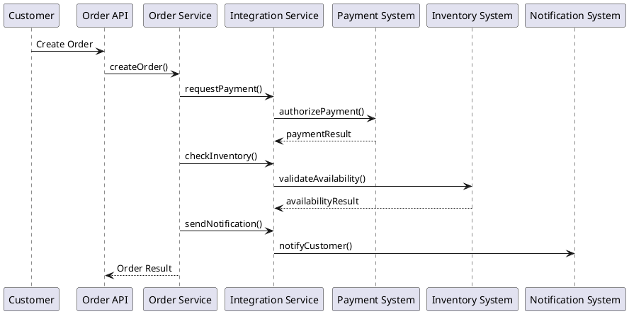

# Integration Service

## Purpose

The Integration Service acts as a **centralized outbound gateway** for the
Order Processing System (OPS).

Its primary responsibility is to **isolate the core domain**
(`order-service`) from external systems such as:

- Payment System
- Inventory System
- Notification System
- Accounting System

This module implements an **Anti-Corruption Layer (ACL)** as described
in the system architecture.

---

## Architectural Context

According to the C4 Container Model:

```Order Service → Integration Service → External Systems```

The Integration Service:

- owns communication protocols
- owns external system models
- shields the domain from external failures and changes

The Order Service:

- expresses intent
- reacts to results
- remains independent of integration details

---

## Scope of This Module (Current Delivery)

### In Scope

- Definition of integration boundaries
- Stubbed adapters for external systems
- Deterministic, synchronous behavior
- Observability via logging

### Out of Scope (Intentionally)

- Real payment execution
- Inventory reservation logic
- Messaging, retries, circuit breakers
- Distributed transactions
- External system credentials

This scope is aligned with the **primary architectural drivers**:

- Maintainability
- Time-to-Market
- Reliability

---

## Why Integration Is Centralized

The following concerns motivated a centralized Integration Service:

- External systems evolve independently
- External APIs may be unstable or slow
- Domain logic must remain testable and deterministic
- Future extraction to microservices must be possible

This design supports **evolution by extraction**, not premature decomposition.

---

## Business Flow (High-Level)

1. Order Service processes an order request
2. Order Service delegates external coordination to Integration Service
3. Integration Service:
    - invokes external systems synchronously (stubbed)
    - translates responses to internal results
4. Order Service updates order state based on outcomes

The Order Service never communicates directly with external systems.

---

## Integration Flow (Prepared for Diagram)

The following PlantUML sequence diagram illustrates the intended flow:



This diagram represents architectural intent, not current implementation.

---

## Evolution Strategy

Future iterations may introduce:

- real HTTP clients
- retries & resilience patterns
- async messaging
- event-driven integration

All such changes will occur inside this module without impacting the Order Service.

---

## Payment Integration (Current Iteration Scope)

### Purpose

The Payment Integration models **payment authorization** as a coordination step
in the order lifecycle.

It deliberately **does not implement real payment execution**.

---

### Current Contract

The Payment Integration exposes a **single synchronous authorization operation**.

```java
PaymentResult authorizePayment(PaymentRequest request);
```

Characteristics:

- request/response interaction
- deterministic, stubbed behavior
- no persistence inside Integration Service

---

### Supported Outcomes

- **AUTHORIZED** — payment approved
- **DECLINED** — payment rejected

No additional payment states are modeled in the current iteration.

---

### Failure Handling

- Authorization failures are returned explicitly
- The Order Service decides how to react
- Database consistency is ensured via transactional rollback
- No retries or compensation logic are implemented

---

### Scope Decision (Intentional)

Out of scope for this iteration:

- payment capture / settlement
- refunds
- asynchronous callbacks (webhooks)
- idempotency handling
- regulatory and compliance concerns

This scope keeps the focus on **architecture structure**, not payment complexity.

---

### Evolution Path

Future iterations may introduce:

- asynchronous payment workflows
- retry and idempotency mechanisms
- real HTTP adapters
- extraction into a standalone Payment Service

All changes will remain **isolated inside the Integration Service**.

---

## Inventory Integration (Current Iteration Scope)

### Purpose

The Inventory Integration models **product availability validation**
as a coordination step before order confirmation.

It intentionally **does not manage stock reservations or withdrawals**.

---

### Current Contract

The Inventory Integration exposes a **single synchronous availability check**.

```java
InventoryCheckResult checkAvailability(InventoryRequest request);

```

Characteristics:

- deterministic, stubbed response
- read-only interaction
- no state mutation

---

### Supported Outcomes

- **AVAILABLE** — sufficient inventory
- **UNAVAILABLE** — insufficient inventory

Partial reservations and backorders are not modeled.

---

### Failure Handling

- Availability failures are explicit
- The Order Service controls order state transitions
- No retries or fallback strategies are implemented

---

### Scope Decision (Intentional)

Out of scope for this iteration:

- inventory reservation and release
- stock withdrawal
- distributed locking
- eventual consistency mechanisms

This avoids introducing **distributed transaction complexity**
in the modular monolith.

---

### Evolution Path

Future iterations may introduce:

- reservation and release workflows
- asynchronous inventory confirmation
- compensation logic
- extraction into a dedicated Inventory Service

All changes will remain **isolated inside the Integration Service**.

## Notification Integration (Current Iteration Scope)

The Notification integration represents outbound communication to inform
external systems or users about order lifecycle events.

### Purpose

- Emit notifications for significant order state changes
- Demonstrate event-style integration without infrastructure complexity
- Decouple order processing from delivery mechanisms

### Current Implementation

- Synchronous, fire-and-forget invocation
- Stubbed implementation that logs notifications
- No retries or delivery guarantees

### What Is Explicitly Out of Scope

- Email, SMS, or push notification providers
- Templates and localization
- Retry, dead-letter queues, or delivery tracking
- User preferences or subscription management

### Evolution Strategy

In future iterations, this integration can evolve into:

- Asynchronous event publishing
- Message brokers (Kafka, SNS/SQS)
- Independent Notification microservice

These changes will remain isolated within the Integration Service.


---

## Key Architectural Rule

> The Integration Service owns **external coordination**.  
> The Order Service owns **business decisions**.  
> External systems own **execution and state**.


