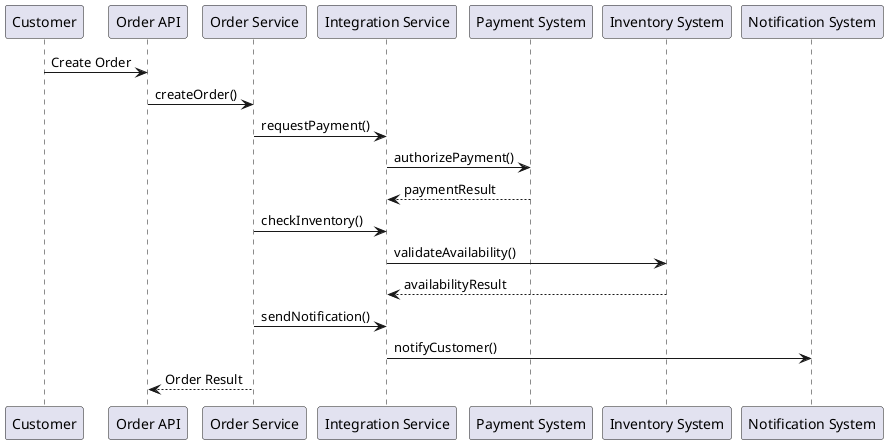

# Integration Service

## Purpose

The Integration Service acts as a **centralized outbound gateway** for the
Order Processing System (OPS).

Its primary responsibility is to **isolate the core domain**
(`order-service`) from external systems such as:

- Payment System
- Inventory System
- Notification System
- Accounting System

This module implements an **Anti-Corruption Layer (ACL)** as described
in the system architecture.

---

## Architectural Context

According to the C4 Container Model:

```Order Service → Integration Service → External Systems```

The Integration Service:

- owns communication protocols
- owns external system models
- shields the domain from external failures and changes

The Order Service:

- expresses intent
- reacts to results
- remains independent of integration details

---

## Scope of This Module (Current Delivery)

### In Scope

- Definition of integration boundaries
- Stubbed adapters for external systems
- Deterministic, synchronous behavior
- Observability via logging

### Out of Scope (Intentionally)

- Real payment execution
- Inventory reservation logic
- Messaging, retries, circuit breakers
- Distributed transactions
- External system credentials

This scope is aligned with the **primary architectural drivers**:

- Maintainability
- Time-to-Market
- Reliability

---

## Why Integration Is Centralized

The following concerns motivated a centralized Integration Service:

- External systems evolve independently
- External APIs may be unstable or slow
- Domain logic must remain testable and deterministic
- Future extraction to microservices must be possible

This design supports **evolution by extraction**, not premature decomposition.

---

## Business Flow (High-Level)

1. Order Service processes an order request
2. Order Service delegates external coordination to Integration Service
3. Integration Service:
    - invokes external systems synchronously (stubbed)
    - translates responses to internal results
4. Order Service updates order state based on outcomes

The Order Service never communicates directly with external systems.

---

## Integration Flow (Prepared for Diagram)

The following PlantUML sequence diagram illustrates the intended flow:



This diagram represents architectural intent, not current implementation.

---

## Evolution Strategy

Future iterations may introduce:

- real HTTP clients
- retries & resilience patterns
- async messaging
- event-driven integration

All such changes will occur inside this module without impacting the Order Service.

---

## Key Architectural Rule

> The Integration Service depends on nothing in the domain.  
> The domain depends only on integration interfaces.

This rule is strictly enforced.

